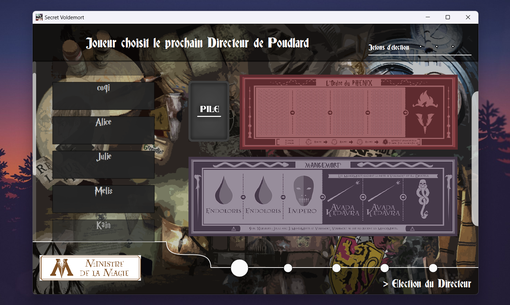
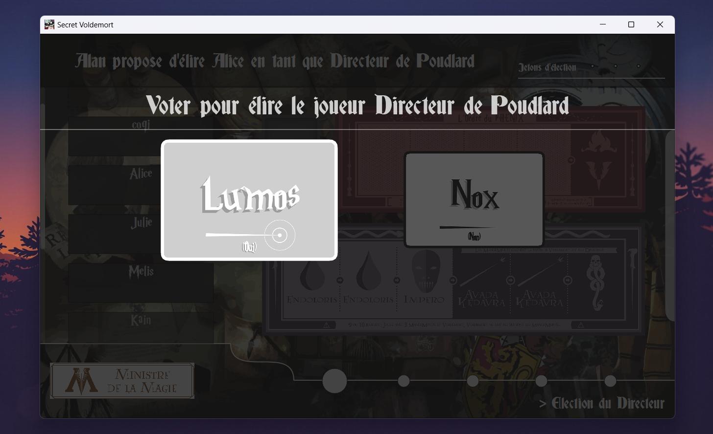
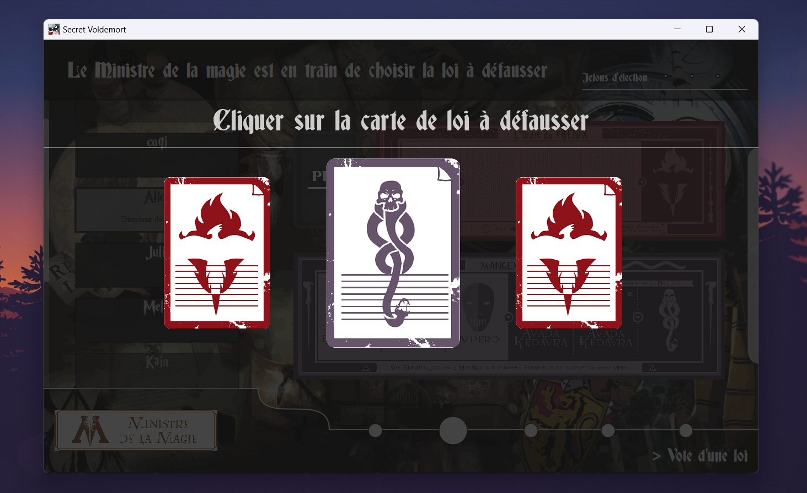
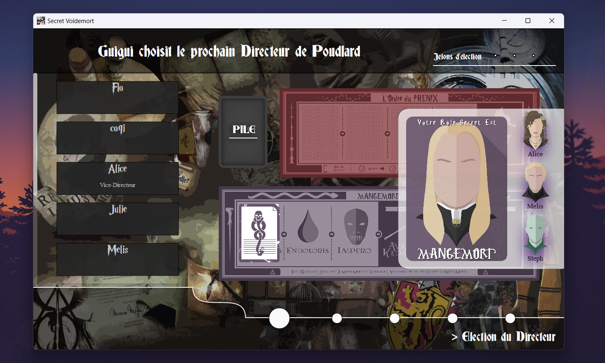

## Description

<ul>
<li>Creator : BRUNE Adrien</li>
<li>Version : 1.0.3</li>
<li>Date : 01/04/2023</li>
</ul>

## Introduction

Secret Voldemort is a strategic game that can be played from 5 up to 10 players.

<i>The realm of magic is threaten by the dark forces of Deatheaters lead by Voldemort himself.
Deatheaters will try to take the power by taking control of the Minister of Magic. Voting policies or electing Voldemort Minister of magic will grant them the power to achieve their ambitions.
On the other hand, powerfull wizards members of the Phenix Order will have to elect policies to take control of the Minister. Killing Voldemort is another way to end the war.
When the game starts you are alone. Try your best to discover players's role and rally your faction to win together, good luck.</i>

## Rules

Official Secret Hitler rules : https://www.secrethitler.com/assets/Secret_Hitler_Rules.pdf  
Video rules : https://www.youtube.com/watch?v=mbGXIDYdtas&ab_channel=TheRulesGirl

## Game preview

## How to play
* The server owner needs to operate a port redirection, this operation allows other players to reach the server owner's computer
    * Go to your Ethernet box's configuration page
    * Got to port redirection and add a new rule
      * set TCP protocol, port range from 30000 to 30000, computer IP address
        * To retrive computer local IP address, go to Windows terminal, then tape the command line "ipconfig", check IPV4 address
* Start server on a computer
  * Give Ethernet port "30000" to other players
  * Give Ethernet public IP to other players
    * Get the public IP from internet (tape "what's my ip" on a navigator)
  * Let them connect to your server, then start a game

## Technical part

Game developed on Qt 5.15.2

Released :
* Windows
* MacOS
  
